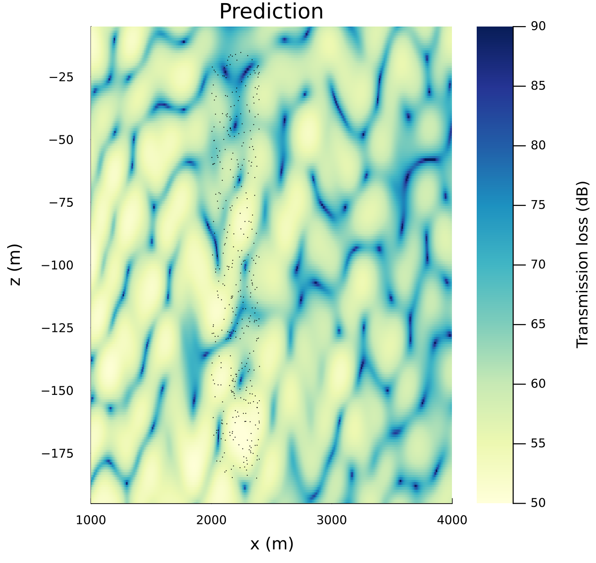
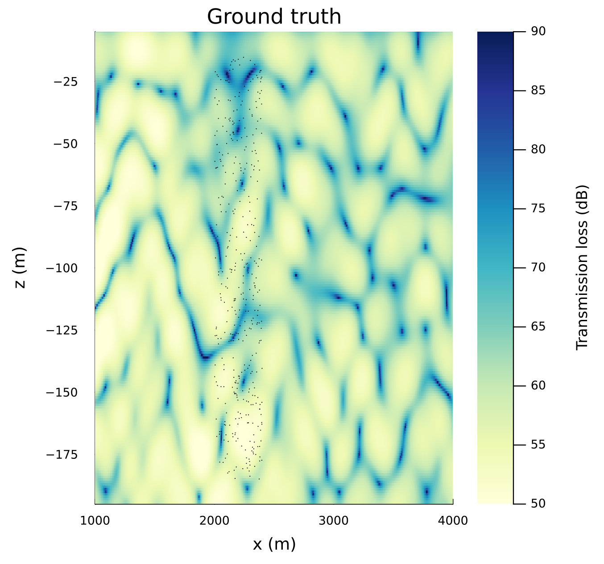

[](https://github.com/org-arl/DataDrivenAcoustics.jl/actions)

# DataDrivenAcoustics

This package also provides physics-based data-driven acoustic propagation models for use with UnderwaterAcoustics.jl. Two model families are currently available: a ray-basis neural network (RBNN) for deep and mid-water propagation, and a modal-basis neural network (MBNN) for shallow-water waveguides, which additionally inverts for the sound-speed profile.

This package first builds upon the ideas discussed in our journal paper "Data-Aided Underwater Acoustic Ray Propagation Modeling" published on IEEE Journal of Oceanic Engineering (available [online](https://ieeexplore.ieee.org/abstract/document/10224658)). It provides a Ray-basis neural network implementation for use with [`UnderwaterAcoustics.jl`](https://github.com/org-arl/UnderwaterAcoustics.jl).

This package also builds upon the ideas discussed in our journal paper "Physics-Aided Data-Driven Modal Ocean Acoustic Propagation Modeling", (available [online](https://arl.nus.edu.sg/wp-content/uploads/2022/09/Kexin_Physics-aided_ICAKorea2022.pdf)). It provides a Modal-basis neural network implementation for use with [`UnderwaterAcoustics.jl`](https://github.com/org-arl/UnderwaterAcoustics.jl).

Conventional acoustic propagation models require accurate environmental knowledge to be available beforehand. While data-driven techniques might allow us to model acoustic propagation without the need for extensive prior environmental knowledge, such techniques tend to be data-hungry. We propose physics-based data-driven acoustic propagation modeling approaches that enable us to train models with only a small amount of data. The proposed modeling frameworks are not only data-efficient, but also offer flexibility to incorporate varying degrees of environmental knowledge, and generalize well to permit extrapolation beyond the area where data were collected.

> [!NOTE]
> The API for `DataDrivenAcoustics.jl` changed significantly in `v0.3` to align itself with newer versions of `UnderwaterAcoustics.jl`. Some of the functionality from `v0.2` has not yet been ported to `v0.3`, so if you need older functionality, please use `v0.2`. We will add back much of the functionality and more soon!

## Installation

```julia
julia> # press ]
pkg> add UnderwaterAcoustics, DataDrivenAcoustics
```
We first start by loading some helpful dependencies:
```julia
using UnderwaterAcoustics
using DataDrivenAcoustics
using StableRNGs
using Plots
```

## Ray Models

We prepare a dataset by sampling transmission loss at 1000 random locations from a `PekerisRayTracer` propagation model:
```julia
env = UnderwaterEnvironment(seabed=Rock, bathymetry=200.0)
pm1 = PekerisRayTracer(env; max_bounces=3)
tx = AcousticSource(0, -11, 250)
rxpos = rand(StableRNG(27), 2, 1000) .* [200.0, 40.0] .+ [5500.0, -110.0]
rxs = [AcousticReceiver(rxpos[1,i], rxpos[2,i]) for i ∈ 1:size(rxpos,2)]
xloss = Float32.(transmission_loss(pm1, tx, rxs))
```
We use a `StableRNG` random number generator for reproducibility of this example. We now have transmission loss data measured at 1000 random locations in a 5.5 to 5.7 km range and 70 to 110 m depth.

We would like to use this data to build a data-driven propagation model:
```julia
pm = DataDrivenPropagationModel(RayBasisNN_2D(60); rng=StableRNG(42))
```
This creates an untrained model, initialized with random weights. We next prepare a loss function that measures the prediction error for the dataset we created:
```julia
rxs = [AcousticReceiver(x, z) for (x, z) ∈ zip(rxpos[1,:], rxpos[2,:])]
loss = TransmissionLossMSE(pm, AcousticSource(nothing, 250), rxs, xloss)
```
Once we have the loss function, we can train the propagation model. We do the training in 2-phases, as is common for physics-guided problems. The first phase uses an `Adam` optimizer to find a good solution:
```julia
DataDrivenAcoustics.fit!(pm, loss;
  optimizer = Adam(5e-6),           # ADAM with specified learning rate
  minloss = 100,                    # minimize until loss < 100
  maxiters = 5000,                  # or until 5000 epochs have passed
  show_progress = 100)              # print progress every 100 epochs
```
The second phase uses a `BFGS` optimizer to refine the solution to a local minimum:
```julia
DataDrivenAcoustics.fit!(pm, loss;
  optimizer = BFGS(),               # BFGS quasi-Newton optimizer
  maxiters = 200,                   # minimize to a maximum of 200 iterations
  show_progress = 1)                # print progress every iteration
```
We can now use the model to predict transmission loss in an area of interest. Note that the model is able to extrapolate well beyond the area where measurements were made (shown as block dots below):
```julia
rx = AcousticReceiverGrid2D(5300:6000, -200:-20)
x = transmission_loss(pm, AcousticSource(nothing, 250), rx)
plot(rx, x; clim=(50,100), xlims=(5300,6000), ylims=(-200,-20))
scatter!([p for p ∈ zip(rxpos[1,:], rxpos[2,:])]; markersize=0.5, color=:black)
```


We compare this with the ground truth from the original physics-based propagation model:
```julia
x = transmission_loss(pm1, tx, rx)
plot(rx, x; clim=(50,100), xlims=(5300,6000), ylims=(-200,-20))
scatter!([p for p ∈ zip(rxpos[1,:], rxpos[2,:])]; markersize=0.5, color=:black)
```


While we see that the match is not perfect, it is pretty impressive given that we have no measurements in the extrapolated area!

## Modal Models

For shallow-water waveguides, where the field is well described by a small number of propagating modes, we use `ModalBasisNN_2D` instead. The workflow is the same as above, with three differences: the model is trained on the complex field (magnitude and phase) rather than transmission loss, it is tied to a single frequency fixed at construction time, and it additionally recovers the sound-speed profile.

The dataset comes from a `PekerisModeSolver`, sampled at 400 random locations:
```julia
env = UnderwaterEnvironment(bathymetry=200.0, soundspeed=1500.0,
                            seabed=FluidBoundary(1800.0, 1650.0))
pm1 = PekerisModeSolver(env; nmodes=12)
tx = AcousticSource(0.0, -40.0, 100.0)
rxpos = rand(StableRNG(1224), 2, 400) .* [400.0, 170.0] .+ [2000.0, -185.0]
rxs = [AcousticReceiver(rxpos[1,i], rxpos[2,i]) for i ∈ 1:size(rxpos,2)]
xfield = ComplexF32.(acoustic_field(pm1, tx, rxs))
```
This gives complex field samples in a 2.0 to 2.4 km range and 15 to 185 m depth, in a 200 m waveguide at 100 Hz.

The model takes the waveguide depth and source frequency, and is wrapped in the same framework:
```julia
pm = DataDrivenPropagationModel(
  ModalBasisNN_2D(200.0, 100.0; nmodes=12, nhidden=16,
                  cmin=1400.0, cmax=1600.0, cinit=1500.0,
                  rref=2200.0, seabed=FluidBoundary(1800.0, 1650.0));
  rng=StableRNG(42))
```
`cmin` and `cmax` must bracket the true sound speed, since the learned c(z) is squashed into that interval and cannot reach either endpoint. `rref` should sit inside the measurement band. `seabed` should match the ground-truth environment where possible — it's only used to warm-start the initial wavenumber guess, but a mismatched seabed can slow convergence noticeably.

The loss measures complex field error with L1 regularization on the modal coefficients:
```julia
loss = ComplexAmplitudeMSE(pm, tx, rxs, xfield; sparsity=1f-4)
```
The `sparsity` weight must be scaled to the magnitude of the data — too large a value drives the coefficients to zero and the model predicts a null field.

Training uses the same `fit!`, but with `Zygote` as the automatic differentiation backend, which suits this layer's broadcast-heavy forward pass far better than the `AutoReverseDiff()` default:
```julia
using Zygote, ADTypes

DataDrivenAcoustics.fit!(pm, loss, AutoZygote();
  optimizer = Adam(5e-6),           # ADAM with specified learning rate
  maxiters = 5000,                  # minimize for 5000 epochs
  show_progress = 100)              # print progress every 100 epochs
```

Prediction and comparison work exactly as before:
```julia
rx = AcousticReceiverGrid2D(1000.0:5.0:4000.0, -195.0:1.0:-5.0)
x = transmission_loss(pm, tx, rx)
x_true = transmission_loss(pm1, tx, rx)

p1 = plot(rx, x_true; xlims=(1000,4000), ylims=(-195,-5), clim=(50,90), title="Ground truth")
scatter!(p1, rxpos[1,:], rxpos[2,:]; markersize=0.5, color=:black, label="")

p2 = plot(rx, x; xlims=(1000,4000), ylims=(-195,-5), clim=(50,90), title="Prediction")
scatter!(p2, rxpos[1,:], rxpos[2,:]; markersize=0.5, color=:black, label="")

plot(p1, p2; layout=(1,2), size=(1200,550),
     left_margin=8*Plots.mm, bottom_margin=5*Plots.mm)
```


```julia
x = transmission_loss(pm1, tx, rx)
plot(rx, x; xlims=(1000,4000), ylims=(-195,-5))
scatter!([p for p ∈ zip(rxpos[1,:], rxpos[2,:])]; markersize=0.5, color=:black)
```


Unlike the ray model, the modal parameters are physically meaningful, so the trained model also gives us the inverted sound-speed profile and the per-mode horizontal wavenumbers:
```julia
julia> modes = arrivals(pm, tx, rx1)   # ModeArrival per mode: m, kᵣ, vₚ = ω/kᵣ
12-element Vector{ModeArrival}:
 mode 1:  kᵣ = 0.418527 rad/m, vₚ = 1501.26 m/s
 mode 2:  kᵣ = 0.417767 rad/m, vₚ = 1503.99 m/s
 mode 3:  kᵣ = 0.416894 rad/m, vₚ = 1507.14 m/s
 mode 4:  kᵣ = 0.414813 rad/m, vₚ = 1514.70 m/s
 mode 5:  kᵣ = 0.412647 rad/m, vₚ = 1522.65 m/s
 mode 6:  kᵣ = 0.409930 rad/m, vₚ = 1532.74 m/s
 mode 7:  kᵣ = 0.404691 rad/m, vₚ = 1552.59 m/s
 mode 8:  kᵣ = 0.401349 rad/m, vₚ = 1565.51 m/s
 mode 9:  kᵣ = 0.397844 rad/m, vₚ = 1579.31 m/s
 mode 10: kᵣ = 0.391702 rad/m, vₚ = 1604.07 m/s
 mode 11: kᵣ = 0.385701 rad/m, vₚ = 1629.03 m/s
 mode 12: kᵣ = 0.379055 rad/m, vₚ = 1657.59 m/s
```

For a complete example of joint field prediction and sound-speed inversion, see [`examples/`](examples/).

## Publications
### Primary papers

- K. Li and M. Chitre, “Data-aided underwater acoustic ray propagation modeling,” 2023. [(online)](https://ieeexplore.ieee.org/abstract/document/10224658)
- K. Li and M. Chitre, "Physics-aided data-driven modal ocean acoustic
  propagation modeling," in International Congress of Acoustics, 2022.

### Other useful papers

- K. Li and M. Chitre, “Ocean acoustic propagation modeling using scientific machine learning,” in OCEANS: San Diego–Porto. IEEE, 2021, pp. 1–5.
- F. B. Jensen, W. A. Kuperman, M. B. Porter, and H. Schmidt, *Computational Ocean Acoustics*, 2nd ed. New York: Springer, 2011.
